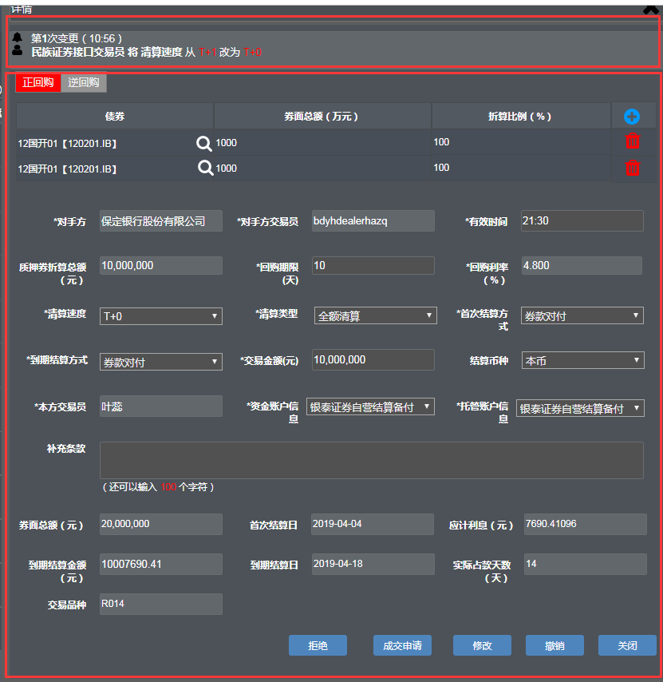
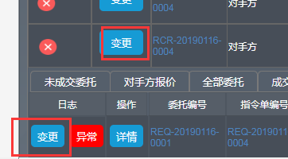

### 指令单

指令单操作：

对于本方发起的，未发送时可发送和作废，发送后未成交前可撤销；对于对手方发起的，只存在作废

### 委托列表

委托列表中：

- 本方发起，对手方未回复前，本方可修改。详情中可进行的操作有**<u>修改、撤销、关闭</u>**。

- 对手方发起，本方不可修改。有可关联指令单时委托编号中显示”关联指令单“，在关联指令单页面可进行成交或拒绝操作，详情页面不可进行任何操作，关联指令单页面参考协议式回购关联指令单页面，列表显示要素与质押式回购指令单中要素相同；无可关联指令单时详情中可进行的操作有成交申请、拒绝、关闭；**点击成交申请转到申请页面时，所有要素都带出来且不可修改**
- **对手方报价**的详情中，可进行的操作有<u>**成交申请、关联指令单、拒绝**</u>

### 详情界面

下委托以及详情界面 逆回购的时候是绿色就行了 显示的字段是一样的

> 详情部分可分为上下两大部分，下面部分可以同时给下委托界面使用，**<u>注意对编辑不可编辑进行标记以及特殊处理</u>**

**指令单变更**操作与**委托列表的变更**操作界面一致

### 枚举数据

##### 详情界面

1. 清算类型 => ClearingMethod_TradeAPI
2. 清算速度 => SettleType
3. 首次结算方式 => DeliveryType
4. 到期结算方式 => DeliveryType

##### 申请界面

1. 回购利率 => RepoRateType

### Q:

1. 详情界面中很多枚举是后端提供还是前端定义

   **<u>结算币种、资金帐户信息、托管账户信息</u>**