#### 环境搭建以及文件配置（配置相关）

1. Node安装

   node版本：v10.5.0

   安装教程地址：https://www.runoob.com/nodejs/nodejs-install-setup.html

2. 运行项目

   > node环境安装完成后，双击`/svn/H6/branches/TradeApi/04.Development/TradeWeb/run.bat`可执行文件，默认在8000端口启动服务。

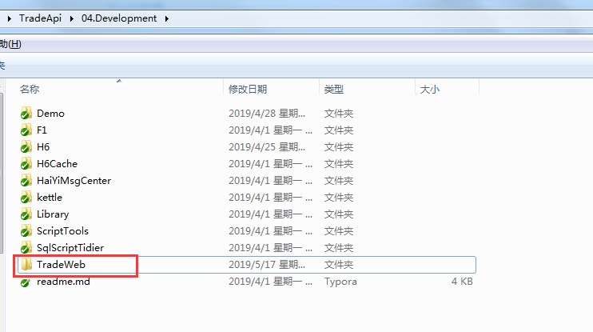

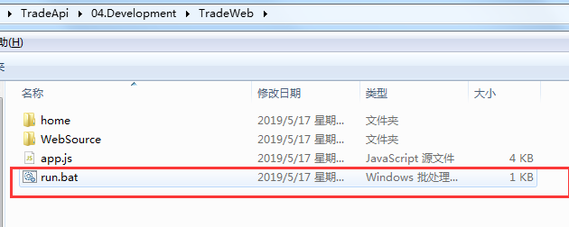

> 在`app.js`中更改网站部署端口以及接口跳转地址

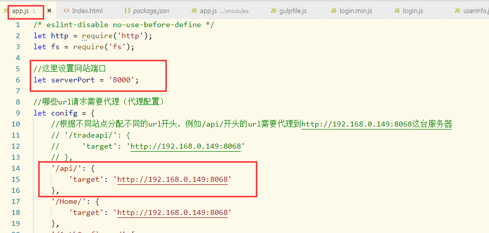

#### 前端文件的处理（前端相关，为其他项目做前后端分离给予帮助）

一、文件结构

1. 文件结构以及index.html和login.html文件处理

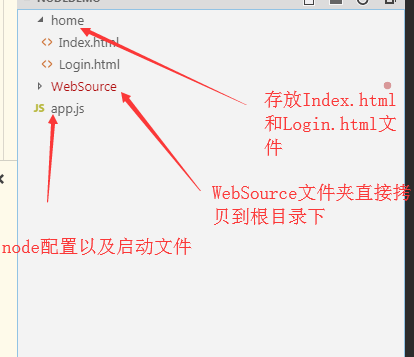

`Index.html`和`Login.html`是从原来的`H6\HaiYi.Web\Views\Home`文件夹下的`Index.chtml`和`Login.chtml`转换而来。需要将`Index.chtml`和`Login.chtml`文件中有c#注释的地方删除。

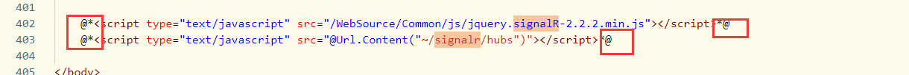

2. 原来系统中返回到登录界面使用的`/Home/Login`路径需要更改为`/home/Login.html`

   修改前：

   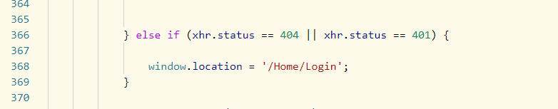

   修改后：

   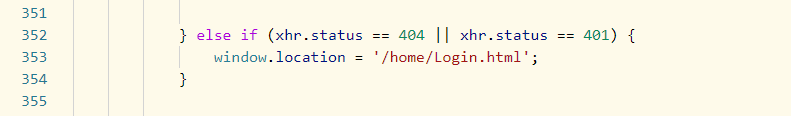

   

二、**==避免不必要的后缀名！！！避免不必要的后缀名！！！避免不必要的后缀名！！！==**

1. 注释或修改`box.debug.js`文件下关于文件版本的代码

   修改点1：

   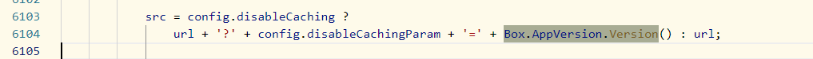

   修改后：

   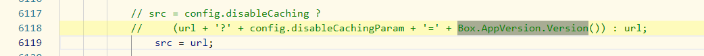

   修改点2：

   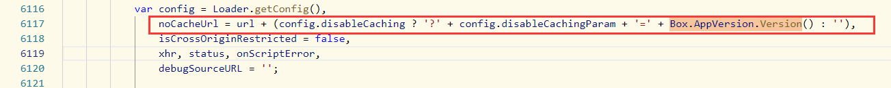

   修改后：

   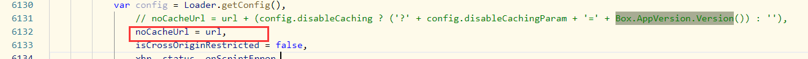

   修改点3：

   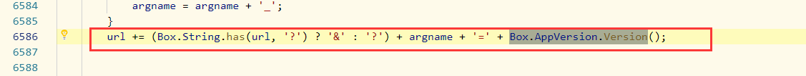

   修改后：

   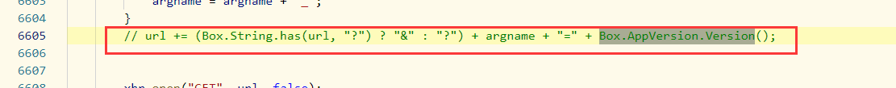

2. 全局替换带有版本号或特殊字符后缀的文件

   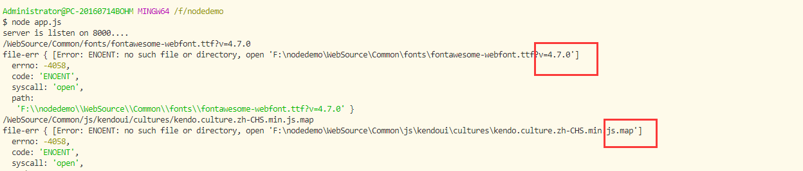

   

   `fonts\fontawesome-webfont.ttf?v=4.7.0`     =>    `fonts\fontawesome-webfont.ttf`

   `js\kendoui\cultures\kendo.culture.zh-CHS.min.js.map`    =>    `js\kendoui\cultures\kendo.culture.zh-CHS.min.js`

   > 第一个为字体文件，在`CSS`中引用，第二个为js文件,**注意在替换`.map`后缀时别把js语法的`.map()`给替换了。**
   >
   > The project has started on 8000

   