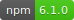
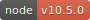
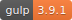
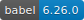
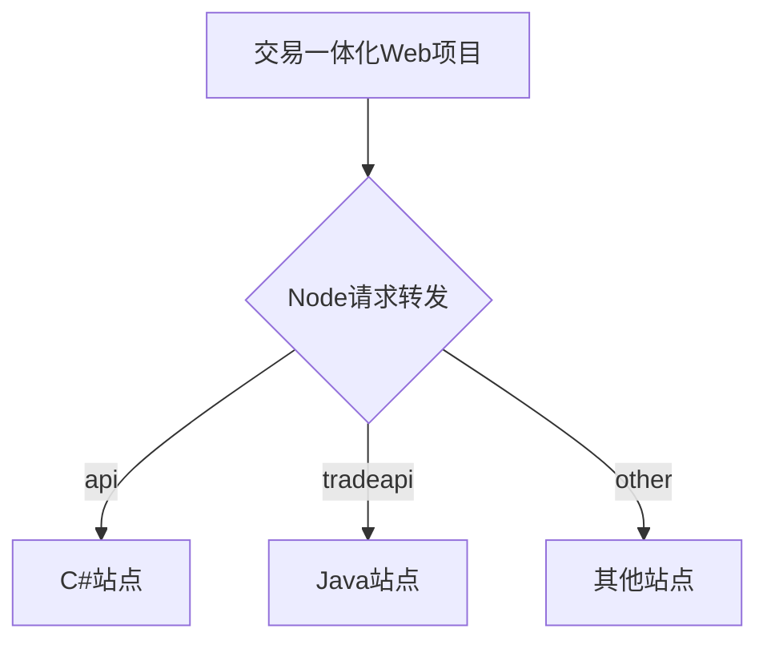

# 交易一体化Web项目



一个与后端分离，且可以请求不同站点接口的前端项目。


## 为什么要建这个项目

由于交易一体化项目开发过程中需要请求不同站点上的C#和Java接口,故而打算使用一套前台系统，通过node转发请求达到节省服务器资源、降低前端维护成本的目的。




## 技术栈和主要框架

- [Boxjs](http://192.168.0.178:8080/doc/index.html#/api/Box)
- [Kendo ui](https://www.telerik.com/kendo-ui-html-framework-opt)
- [ES5 + ES6]()[http://es6.ruanyifeng.com/](http://es6.ruanyifeng.com/)
- [Nodejs]([http://nodejs.cn/](http://nodejs.cn/))
- [Gulp](https://www.gulpjs.com.cn/)
- [babel](https://www.babeljs.cn/)


## 安装

项目需要搭配Node环境使用，没有安装过Node环境的请[单击此处](https://www.runoob.com/nodejs/nodejs-install-setup.html)。


## 使用

- 项目启动

  直接双击执行根目录下的`run.bat`批处理文件，也可以在根目录下使用命令行启动项目，默认使用`8000`端口

  ```shell
  node app.js
  ```

- 项目配置

  你可以在`/app.js `文件中对网站部署的端口，以及需要路由转发的站点进行配置

  ```js
  //这里设置网站端口
  let serverPort = '8000';
  
  //哪些url请求需要代理（代理配置）
  let conifg = {
      //根据不同站点分配不同的url开头，例如/api/开头的url需要代理到http://192.168.0.149:8068这台服务器
      // '/tradeapi/': {
      //     'target': 'http://192.168.0.149:8068'
      // },
      '/api/': {
          'target': 'http://192.168.0.149:8068'
      },
  };
  ```

  

- 文件压缩和打包

  在`/WebSource/Common`目录下执行如下命令安装所需要的工具

  ```shell
  npm install 
  ```

  完成后使用如下命令完成文件的压缩以及代码转换

  ```shell
  gulp <taskname>
  ```

  相关任务名称：

  - logincss   压缩登录页面用到的css
  - loginjs   压缩登录页面用到的第三方js
  - indexcss   压缩主页用到的css
  - indexjs   压缩主页用到的第三方js
  - Alljs    把前端用到的各个模块的js文件全部压缩打包，并进行ES6到ES5的转换

  > 不添加`taskname`则执行default任务，耗时较长，发布版本时使用。具体打包逻辑可以在`/WebSource/Common/gulpfile.js`中查看
  >
  > 所有打包压缩后的文件放在`/WebSource/Common/release`文件夹下


## 文件结构

```
│  app.js    //项目配置及启动文件
│  run.bat   //项目启动批处理文件
│  
├─home
│      Index.html   //网站入口界面
│      Login.html   //网站登录界面
│      
└─WebSource	  //项目文件夹
```


