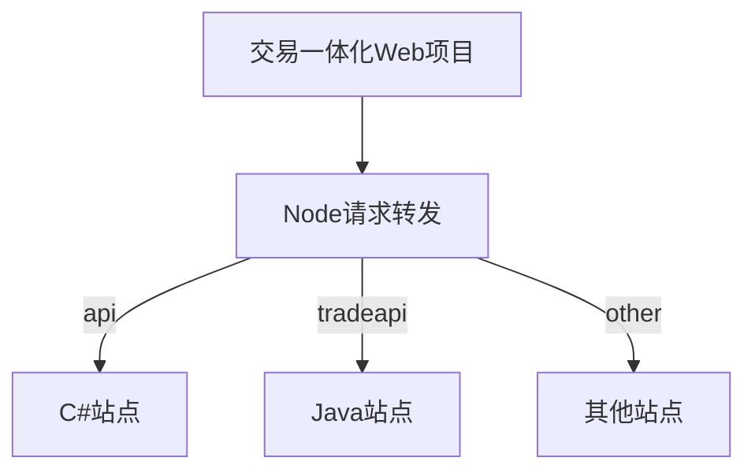

# 交易一体化Web项目

一个与后端分离的前端项目。

## 为什么要建这个项目

由于交易一体化项目开发过程中需要请求不同站点上的C#和Java接口,

```mermaid
graph TB
A[交易一体化Web项目] -->B[Node请求转发]
    B -->|api| D[C#站点]
    B -->|tradeapi| E[Java站点]
    B -->|other| F[其他站点]
```

## 目录